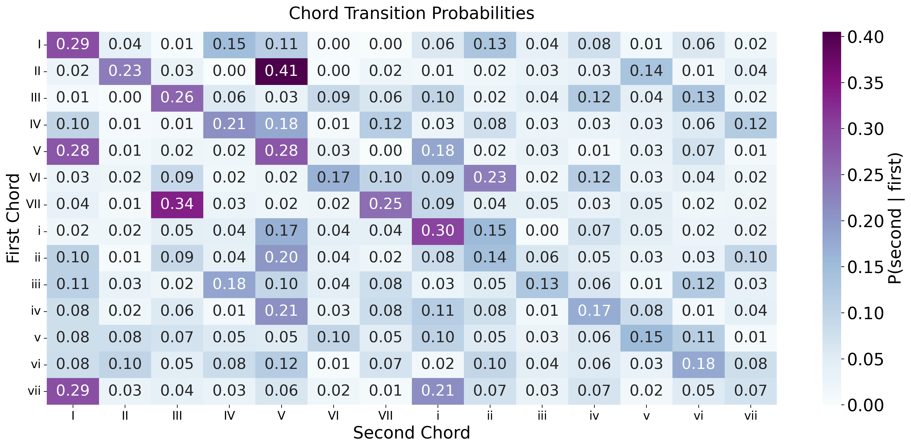
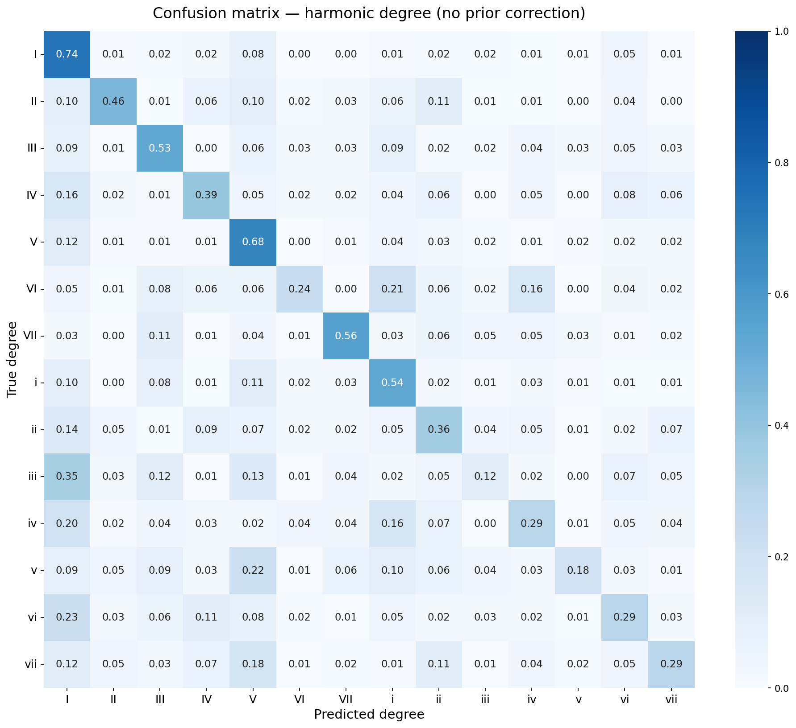
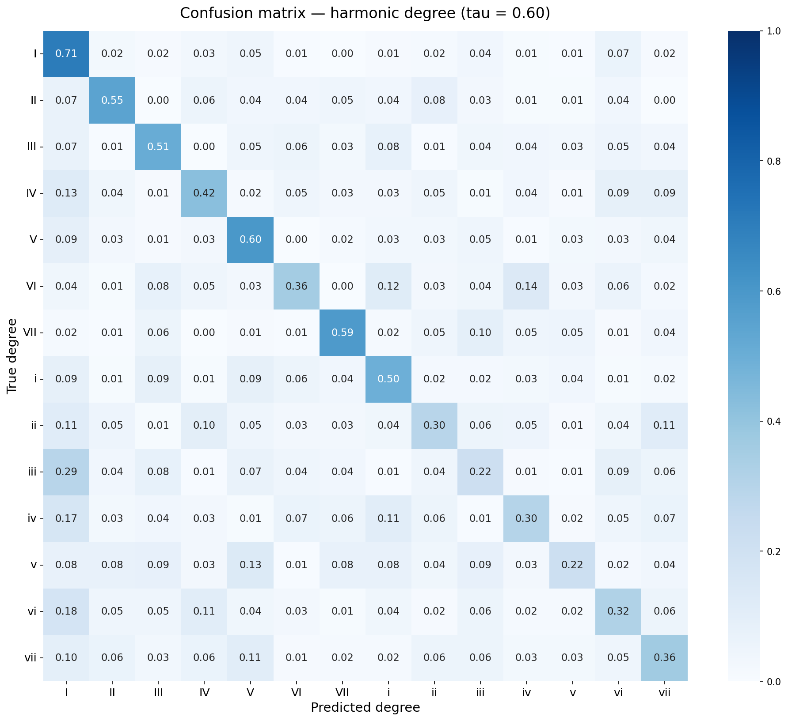
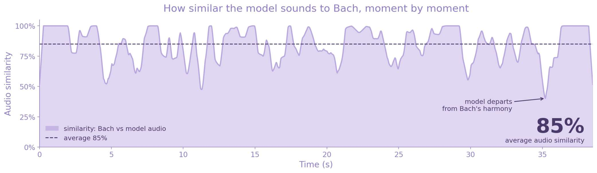

<div align="center">
  <h1>Completing Unfinished Bach</h1>
  <h3>Roman analysis on Bach's chorales — with no note information</h3>
</div>


[](https://github.com/ACM40960/completing-unfinished-bach/stargazers)

🎼 Have you ever thought that behind a piece of music there are harmonic dependencies with relations potentially stronger than the sound itself? This project models the harmonic relations between Roman numerals and their properties (major, minor, inverted, and so on) in Bach's chorales — **without using notes or MIDI data at all**. From the music21 Bach chorale corpus to a model-ready DataFrame, and on to custom neural networks that complete Bach's unfinished work.

## Table of Contents

- [Abstract](#abstract)
- [Project Description](#project-description)
  - [Why Roman Numerals?](#why-roman-numerals)
  - [Key Components](#key-components)
- [Data](#data)
  - [From music21's corpus to an explorable DataFrame](#from-music21s-corpus-to-an-explorable-dataframe)
  - [Variables](#variables)
- [Models](#models)
  - [Markov baseline](#1-markov-baseline)
  - [Linear model](#2-linear-model)
  - [GRU / LSTM](#3-gru--lstm)
  - [Chained LSTM](#4-chained-lstm-final-model)
- [Results](#results)
- [Hearing the Result](#hearing-the-result)
- [Repository Structure](#repository-structure)
- [Running the Notebooks](#running-the-notebooks)
- [Limitations and Future Work](#limitations-and-future-work)
- [Project Poster](#project-poster)
- [References](#references)
- [Author](#author)

## Abstract

The harmonic conventions of the Baroque exist to let a composer direct expectation through perceptually grounded patterns, expressed as musical rules. This project presents an analysis of Bach's chorales that models the harmonic relations between Roman numerals and their properties (major, minor, inverted, and so on) without using notes or MIDI data at all. A first-order Markov analysis gives a cross-entropy ≈ 2.20, equal to a perplexity ≈ 9 — the number of possible chords drops from 14 possible choices to 9 by looking only at the previous chord. The order of the different methods that were tested in order to conclude to a final model is: **Markov → linear → GRU → LSTM → chained**, trained with 362 chorales and 29,795 chords, split by chorale (262 train / 50 validation / 50 test). The final chained LSTM reaches **48.3% top-1 / 73.0% top-3 accuracy** on the next Roman degree, and out of roughly 300 possible complete chord specifications it reproduced Bach's own choice exactly — degree, quality, inversion, seventh and duration all matching the Riemenschneider harmonisation — in **18.3%** of cases. Translated back into notes, the two versions sound very close (**85%** audio similarity).

## Project Description

### Why Roman Numerals?

The harmonic conventions of the Baroque exist to let a composer direct expectation through perceptually grounded patterns, expressed as musical rules:

| Move | Effect |
|---|---|
| V → I | resolution, closure |
| V → vi | deceptive, suspended |
| IV → V | preparation, curiosity about what follows |

These moves live at the level of *harmonic function*, not individual notes. Working directly in Roman numeral space asks a sharper question than note-level modelling — and shifts the goal from reproducing Bach to **continuing his intentions**.

### Key Components

- **Data extraction:** search all of the files (Bach's chorales) included in the corpus — the ones with 4 voices — and organise everything based on the bar, an important task for Roman numeral analysis, creating a dataset with roman_scale_degrees, chord_quality, inversion, has7 and beat_strength.
- **Markov analysis:** a heat map to inspect connections when we change from one chord (Roman number) to the other, with the probability that the second chord will occur given that the first chord has occurred.
- **Model sweeps:** LSTM, GRU and a linear model trained for each combination of hyperparameters (window size, units, dropout).
- **Chained LSTM:** each time a chord has been predicted, the results from all predictors are added as an observation for the next prediction.
- **Audio rendering:** converting a chorale and its predicted version to .wav — Bach's part first, and after that the prediction.

## Data

### From music21's corpus to an explorable DataFrame

One of the safest and cleanest ways (without any noise) to obtain Bach's chorales into a dataset is through [music21](https://web.mit.edu/music21/) — a well-known, trustworthy library that contains scores for the purpose of being studied, with more than just the notes turned into data (Roman numeral chords, key, anacrusis, offset, etc.). However, the data lives in nested stream structures that need careful processing to become a readable, model-ready table.

**Step 1 — Bach's chorales in music21's corpus.** The corpus is searched with `corpus.search(sourcePath='bach', numberOfParts=4)`, returning the 368 four-voice chorale files (see music21's [User's Guide, Chapter 11: Corpus Searching](https://music21.org/music21docs/usersGuide/usersGuide_11_corpusSearching.html) for the general mechanism). Alternatives such as `corpus.chorales.Iterator()` or downloading scores online were examined and rejected — the first only limits what `corpus.search` already provides, the second introduces noise while the corpus already contains all of Bach's chorales accurately.

**Step 2 — Duplicates and different harmonic interpretations.** Chorales sharing a BWV id can be duplicate formats of the same piece (.krn vs .mxl) or genuinely different harmonic interpretations of the same hymn. BWV ids are extracted from the file paths; .krn duplicates are removed (the same chorale already exists in .mxl form), and one chorale present in two versions is dropped entirely to prevent any data leak. Chorales containing non-Roman chords (French/German/Italian augmented sixths) are also removed whole — deleting a single chord would disturb the natural flow of the progression.

**Step 3 — A bar-aware, offset-indexed table.** Analysis of a Baroque piece starts by recognising the key (`analyze('key')`). Measure data is extracted via `getElementsByClass('Measure')`, mapping music21's attributes `number`, `numberSuffix`, `offset`, `duration.quarterLength`, `paddingLeft` to the columns `bar`, `suffix`, `offset`, `len`, `anacrusis`. One subtlety matters: **bar numbers are not unique** — when the suffix is not empty, the bar number repeats (e.g. bar `4` and bar `4a`), so the offset, not the bar number, is used to traverse a chorale.

<details>
<summary>Example — navigating bwv101.7 per bar and per SATB voice (click to expand)</summary>

```
current bar: 0
Soprano
{0.0} <music21.key.Key of d minor>
{0.0} <music21.meter.TimeSignature 4/4>
{0.0} <music21.note.Note A>
Alto
{0.0} <music21.note.Note F>
Tenor
{0.0} <music21.note.Note D>
Bass
{0.0} <music21.note.Note D>
current bar: 1
Soprano
{0.0} <music21.note.Note A>
{1.0} <music21.note.Note F>
{2.0} <music21.note.Note G>
{3.0} <music21.note.Note A>
...
current bar: 4
Soprano
{0.0} <music21.note.Note F>
{1.0} <music21.note.Note G>
{2.0} <music21.note.Note A>
current bar: 4a        <-- same bar number, different suffix
Soprano
{0.0} <music21.note.Note A>
...
```

The full printout (and per-voice SATB extraction utilities) can be reproduced with the exploration cells in [`Notebooks/data_extraction.ipynb`](Notebooks/data_extraction.ipynb).

</details>

After filtering: **368 files found → 362 chorales kept → 29,795 chords**. The split is **grouped by chorale** — 262 train / 50 validation / 50 test with a fixed seed — so models are always evaluated on chorales they have never seen.


### Variables

| Variable | Distinct values | Description |
|---|---|---|
| roman_scale_degree | 14 | Degree with mode (I–VII, i–vii) — main prediction target |
| chord_quality | 5 | major, minor, diminished, augmented, other |
| inversion | 6 | 0 = root position, 1–5 = inversions |
| has7 | 2 | seventh present or not |
| duration | 12 | 0.125–8.0 quarter notes |
| beat_strength | continuous | metrical weight, 1.0 (downbeat) – 0.0625 |
| steps_to_end | integer | chords remaining until the end of the chorale |

14 Roman degrees are used instead of ~300 complete chord figures: 48% of the full figures appear fewer than 5 times, and since the final model predicts all five properties jointly, no information is left out.

## Models

Tested in order of increasing structure: **Markov → linear → GRU → LSTM → chained**.

### 1. Markov baseline

The probabilities of switching from one Roman numeral to the next, with cross-entropy computed on the transition matrix (Laplace smoothing):



A cross-entropy ≈ 2.20 equals a perplexity ≈ 9 — knowing only the previous chord drops the effective number of choices from 14 to about 9. This structure, together with the earlier literature, motivated the recurrent models that follow.

### 2. Linear model

A logistic-regression-style model (flatten + softmax) on the same windowed inputs — the same information Markov uses, but fitted.

### 3. GRU / LSTM

A recurrent network over a window of previous chords, with embeddings for every categorical variable. Swept over window ∈ {4, 8, 12}, units ∈ {32, 64, 128}, dropout ∈ {0.0, 0.3}. A large improvement on the earlier models; GRU and LSTM differ very little, so no deeper architecture was needed.

### 4. Chained LSTM (final model)

One LSTM (window = 8, 128 units) reads all variables and feeds **five chained softmax heads**, each receiving the previous heads' outputs — duration → Roman degree → quality → inversion → seventh — with loss weights (1.0, 0.5, 0.5, 0.3, 0.5). After each chord, the outputs of all five predictors become the next observation — the information is being stacked for the prediction of the next chord:

```
h_t = LSTM( E(x_r), E(x_q), E(x_i), E(x_7), E(x_d), x_b, x_s )_{t-w : t-1}

ŷ_k = σ( W_k [ h_t ; b_t ; ŷ_<k ] ),        k : d → r → q → i → 7
```

Hyperparameters were fixed rather than searched; same seed for everything.

## Results

**Best performance for each model** (linear/GRU/LSTM: validation-set bests from the sweep; chained: held-out test set):

| Model | CE | PP | top-1 | top-3 | macro-F1 |
|---|---|---|---|---|---|
| Random | 2.64 | 14 | 0.071 | 0.214 | — |
| Majority class | — | — | 0.163 | — | — |
| Markov (1st order) | 2.20 | 9 | — | — | — |
| Linear | 2.12 | 8.4 | 0.315 | 0.590 | 0.261 |
| GRU | 1.90 | 6.7 | 0.405 | 0.665 | 0.336 |
| LSTM | 1.89 | 6.6 | 0.408 | 0.669 | 0.340 |
| **Chained LSTM** | **1.70** | **5.48** | **0.483** | **0.730** | **0.408** |

**Per-target test results of the chained model:**

| Target | Classes | Top-1 | Top-3 | Macro-F1 | Balanced acc. |
|---|---|---|---|---|---|
| Roman degree | 14 | 0.483 | 0.730 | 0.408 | 0.405 |
| Chord quality | 5 | 0.624 | 0.943 | 0.316 | 0.307 |
| Inversion | 6 | 0.572 | 0.905 | 0.250 | 0.246 |
| Seventh | 2 | 0.748 | — | 0.638 | 0.627 |
| Duration | 12 | 0.744 | 0.980 | 0.303 | 0.275 |

Out of roughly 300 possible complete chord specifications, the final model reproduced Bach's own choice **exactly** — degree, quality, inversion, seventh and duration all matching the Riemenschneider harmonisation — in **18.3%** of cases.

**Class imbalance.** Degrees are imbalanced: V occurs 581 times in the test set against 132 for VI, roughly 4:1 — a property of the Baroque style, not a sampling artefact. Prior correction (logit adjustment, tau = 0.60 selected on validation) gave marginal gains only, so uncorrected predictions are reported. `steps_to_end` was not predicted: the time a chorale lasts is affected by parameters outside the model's reach (time limits for a concert, the length of a scene in an oratorio), so it is given prior to the model's creation.

| Without prior correction | With tau = 0.60 |
|---|---|
|  |  |

Full classification reports are generated in [`Notebooks/chained_model_evaluation.ipynb`](Notebooks/chained_model_evaluation.ipynb).

## Hearing the Result

The predicted codes are rendered back to sound — figured-bass Roman numerals → MIDI (music21) → audio (FluidSynth). Bach and the model share the first 8 chords and all durations; from there the model is on its own.



**Chorale BWV 389 (128 chords, the audio demo):** 47% of predicted degrees match the original — the first 8 are the shared opening. Translated back into notes, the two versions sound very close (**85%** frame-wise CQT audio similarity): reproducing a piece as notes is far easier than as degrees (intention representation).

> **Note:** the rendered `.wav` files (Bach vs the model) are not stored in the repository — they are generated by [`Notebooks/audio_rendering.ipynb`](Notebooks/audio_rendering.ipynb). You can listen to them directly here: **[Bach vs the model — audio files](https://jumpshare.com/folder/54VetyiCjVccDgBnDJ0D)** (the poster's QR code links to the same demo).


## Results

**Best performance for each model** (linear/GRU/LSTM: validation-set bests from the sweep; chained: held-out test set):

| Model | CE | PP | top-1 | top-3 | macro-F1 |
|---|---|---|---|---|---|
| Random | 2.64 | 14 | 0.071 | 0.214 | — |
| Majority class | — | — | 0.163 | — | — |
| Markov (1st order) | 2.20 | 9 | — | — | — |
| Linear | 2.12 | 8.4 | 0.315 | 0.590 | 0.261 |
| GRU | 1.90 | 6.7 | 0.405 | 0.665 | 0.336 |
| LSTM | 1.89 | 6.6 | 0.408 | 0.669 | 0.340 |
| **Chained LSTM** | **1.70** | **5.48** | **0.483** | **0.730** | **0.408** |

**Per-target test results of the chained model:**

| Target | Classes | Top-1 | Top-3 | Macro-F1 | Balanced acc. |
|---|---|---|---|---|---|
| Roman degree | 14 | 0.483 | 0.730 | 0.408 | 0.405 |
| Chord quality | 5 | 0.624 | 0.943 | 0.316 | 0.307 |
| Inversion | 6 | 0.572 | 0.905 | 0.250 | 0.246 |
| Seventh | 2 | 0.748 | — | 0.638 | 0.627 |
| Duration | 12 | 0.744 | 0.980 | 0.303 | 0.275 |

Out of roughly 300 possible complete chord specifications, the final model reproduced Bach's own choice **exactly** — degree, quality, inversion, seventh and duration all matching the Riemenschneider harmonisation — in **18.3%** of cases.

**Class imbalance.** Degrees are imbalanced: V occurs 581 times in the test set against 132 for VI, roughly 4:1 — a property of the Baroque style, not a sampling artefact. Prior correction (logit adjustment, tau = 0.60 selected on validation) gave marginal gains only, so uncorrected predictions are reported. `steps_to_end` was not predicted: the time a chorale lasts is affected by parameters outside the model's reach (time limits for a concert, the length of a scene in an oratorio), so it is given prior to the model's creation.

| Without prior correction | With tau = 0.60 |
|---|---|
|  |  |

Full classification reports are generated in [`Notebooks/chained_model_evaluation.ipynb`](Notebooks/chained_model_evaluation.ipynb).

## Project Poster

For a visual overview of the methodology and results — including the audio demo QR code:

[](Poster.pdf)

## References

- Cuthbert & Ariza (2010). *music21: A toolkit for computer-aided musicology.* ISMIR.
- Boulanger-Lewandowski, Bengio & Vincent (2012). *Modeling temporal dependencies in high-dimensional sequences.* ICML.
- Hadjeres, Pachet & Nielsen (2017). *DeepBach: A steerable model for Bach chorales generation.* ICML.

## Author

**Charalampos Sarakatsanis** — Student number 25267220
University College Dublin (UCD) · ACM40960 — Projects in Maths Modelling
📧 [charalampossarakatsanis@gmail.com](mailto:charalampossarakatsanis@gmail.com)
